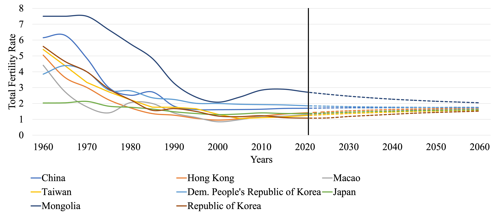
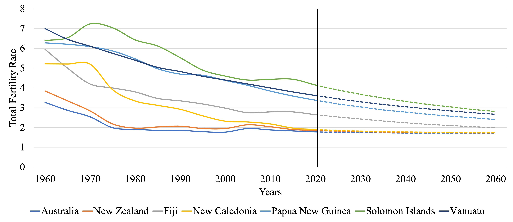
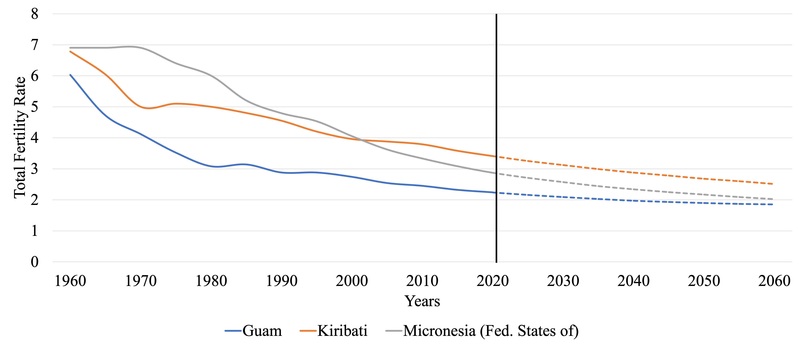
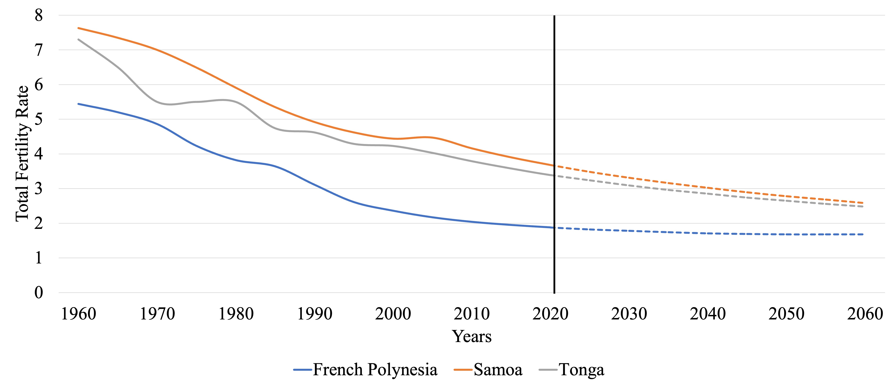

---

##### Download

+ [Book Chapter](bookchapter1.pdf)
<!-- + [Online appendix](appendix2.pdf)
+ [Code and data](https://github.com/pmichaillat/wunk) -->

---

##### Chapter Summary

Unprecedented shifts in population size and structure have occurred in East Asia and Oceania in the second half of the twentieth century and early part of the 21st.1 By 2020, this region was home to some of the world’s lowest total fertility rates (TFRs) in several post-industrialized territories in East Asia. In South Korea, for example, TFR dropped to under one child per woman since 2018. Numerous territories in the region, such as South Korea, are characterized by long life expectancy, high rates of tertiary education, and rapid aging. On the other hand, the fertility transition is still underway in several Pacific Island states, where population growth continues apace. Low levels of literacy, high infant mortality rates, and malnutrition remain challenges for human development in territories such as Papua New Guinea (PNG). In this chapter, we review the wide-ranging population policies which both accompanied and drove these population changes from the 1950s up to the present day.

---

##### Figure: Total fertility rates across East Asia and Oceania, 1960–2060 (a) Major territories in East Asia, (b) Australia, New Zealand, and Major Territories in Melanesia, (c) Major Territories in Micronesia, and (d) Major Territories in Polynesia.






---

<!--

##### Citation

Cheung, JTH., Tang, KC., & Koh, K. (2021). Geographic Clustering of Fast-Food Restaurants Around Secondary Schools in Hong Kong. Preventing Chronic Disease, 18, E56. PMID:34081576. [IF: 4.4]

```BibTeX
@article{PI04,
author = {Cheung, JTH., Tang, KC., & Koh, K. },
year = {2021},
title ={Geographic Clustering of Fast-Food Restaurants Around Secondary Schools in Hong Kong.},
journal = {Preventing Chronic Disease},
volume = {18},
# number = {2},
pages = {E56},
url = {https://www.cdc.gov/pcd/issues/2021/20_0601.htm}}
```

---

##### Related material

+ [Presentation slides](presentation2.pdf)
+ [Wikipedia entry](https://en.wikipedia.org/wiki/The_Finer_Points_of_Sausage_Dogs)

-->
