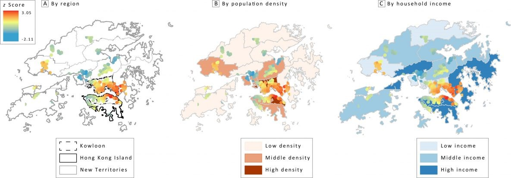

---

##### Download

+ [Paper](paper2.pdf)
<!-- + [Online appendix](appendix2.pdf)
+ [Code and data](https://github.com/pmichaillat/wunk) -->

---

##### Abstract

Introduction: Clustering of fast-food restaurants around schools facilitates fast-food consumption among students, which may cause obesity. We examined the prevalence of fast-food restaurants and identified the clusters of fast-food restaurants near secondary schools in Hong Kong.

Methods: We collected data of Western fast-food chain restaurants and 490 secondary schools in Hong Kong. Descriptive statistics and buffer analysis identified the prevalence of fast-food restaurants around the secondary schools within 400-m and 800-m buffers. Additional analyses compared schools stratified by the 3 main regions in Hong Kong, district-level population density, and median monthly household income. We used Getis-Ord GI* hot spot analysis to measure spatial clusters of fast-food restaurants around schools and Global Moran's I to measure the spatial autocorrelation based on each school and the number of fast-food restaurants within the 400-m buffer.

Results: The average number of fast-food restaurants within 400 m and 800 m of a school was 2.0 and 6.3, respectively. Seven in 10 secondary schools had at least 1 fast-food restaurant within 400 m. The number of schools with no fast-food restaurants was higher in Hong Kong Island, considered the "rich region" in Hong Kong. Hot spots of clusters were significantly located in the high-density downtown areas. We observed significant spatial autocorrelation between fast-food restaurants and secondary schools in the areas with high density, low income, and high income (P < .001, z > 2.58).

Conclusion: Fast-food restaurants were substantially clustered around secondary schools in Hong Kong. Territory-wide studies about the health effect of fast-food clusters around schools on children and adolescents are warranted in Hong Kong.

---

<!--
##### Figure: Hot spot analysis of fast-food restaurants near secondary schools in Hong Kong, by A, region, B, population density, and C, income.



---

##### Citation

Cheung, JTH., Tang, KC., & Koh, K. (2021). Geographic Clustering of Fast-Food Restaurants Around Secondary Schools in Hong Kong. Preventing Chronic Disease, 18, E56. PMID:34081576. [IF: 4.4]

```BibTeX
@article{PI04,
author = {Cheung, JTH., Tang, KC., & Koh, K. },
year = {2021},
title ={Geographic Clustering of Fast-Food Restaurants Around Secondary Schools in Hong Kong.},
journal = {Preventing Chronic Disease},
volume = {18},
# number = {2},
pages = {E56},
url = {https://www.cdc.gov/pcd/issues/2021/20_0601.htm}}
```

---

##### Related material

+ [Presentation slides](presentation2.pdf)
+ [Wikipedia entry](https://en.wikipedia.org/wiki/The_Finer_Points_of_Sausage_Dogs)

-->