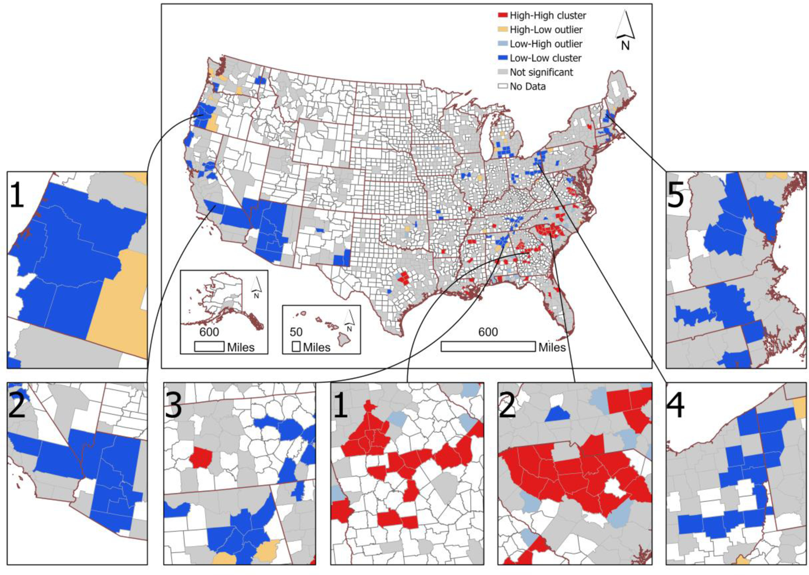

---

##### Download

+ [Paper](paper3.pdf)
<!-- + [Online appendix](appendix2.pdf)
+ [Code and data](https://github.com/pmichaillat/wunk) -->

---

##### Abstract

Background: We investigated the spatial patterns of multiple myeloma (MM) incidence in the United States (US) between 2013 and 2017 to improve understanding of potential environmental risk factors for MM.

Methods: We analyzed the average county-level age-adjusted incidence rates (“ASR”) of MM between 2013 and 2017 in 50 states and the District of Columbia using the U.S. Cancer Statistics Public Use Databases. We firstly divided the ASR into quintiles and described spatial patterns using a choropleth map. To identify global and local clusters of the ASR, we performed the Spatial Autocorrelation (Global Moran’s I) analysis and the Anselin’s Local Indicator of Spatial Autocorrelation (LISA) analysis. We compared the means of selected demographic and socioeconomic factors between the clusters and counties of the whole US using Welch one-sided t-test.

Results: We identified distinct spatial dichotomy of the ASR across counties. High ASR were observed in counties in the Southeast of the US as well as the Capital District (metropolitan areas surrounding Albany) and New York City in the state of New York, while low ASR were observed in counties in the Southwest and West of the US. The ASR showed a significant positive spatial autocorrelation. We identified two major high-high local clusters of the ASR in Georgia and Southern Carolina and five major low-low local clusters of the ASR in Alabama, Arizona, New Hampshire, Ohio, Oregon, and Tennessee. The racial population distribution may partly explain the spatial distribution of MM incidence in the US.

Conclusion: Findings from this study showed distinct spatial distribution of MM in the US and two high-high and five low-low local clusters. The non-random distribution of MM suggests that environmental exposures in certain regions may be important for the risk of MM.

---

##### Figure: Anselin’s Local Indicator of Spatial Autocorrelation (LISA) analysis of the average county-level age-adjusted rates of multiple myeloma incidence between 2013 and 2017 in the United States.



---

<!--

##### Citation

Cheung, JTH., Tang, KC., & Koh, K. (2021). Geographic Clustering of Fast-Food Restaurants Around Secondary Schools in Hong Kong. Preventing Chronic Disease, 18, E56. PMID:34081576. [IF: 4.4]

```BibTeX
@article{PI04,
author = {Cheung, JTH., Tang, KC., & Koh, K. },
year = {2021},
title ={Geographic Clustering of Fast-Food Restaurants Around Secondary Schools in Hong Kong.},
journal = {Preventing Chronic Disease},
volume = {18},
# number = {2},
pages = {E56},
url = {https://www.cdc.gov/pcd/issues/2021/20_0601.htm}}
```

---

##### Related material

+ [Presentation slides](presentation2.pdf)
+ [Wikipedia entry](https://en.wikipedia.org/wiki/The_Finer_Points_of_Sausage_Dogs)

-->