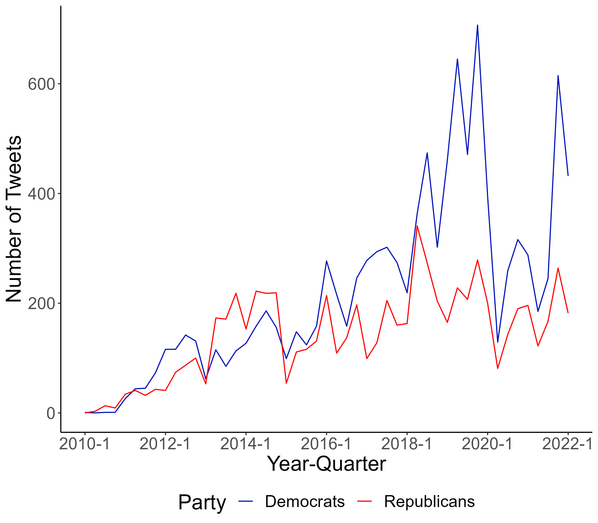
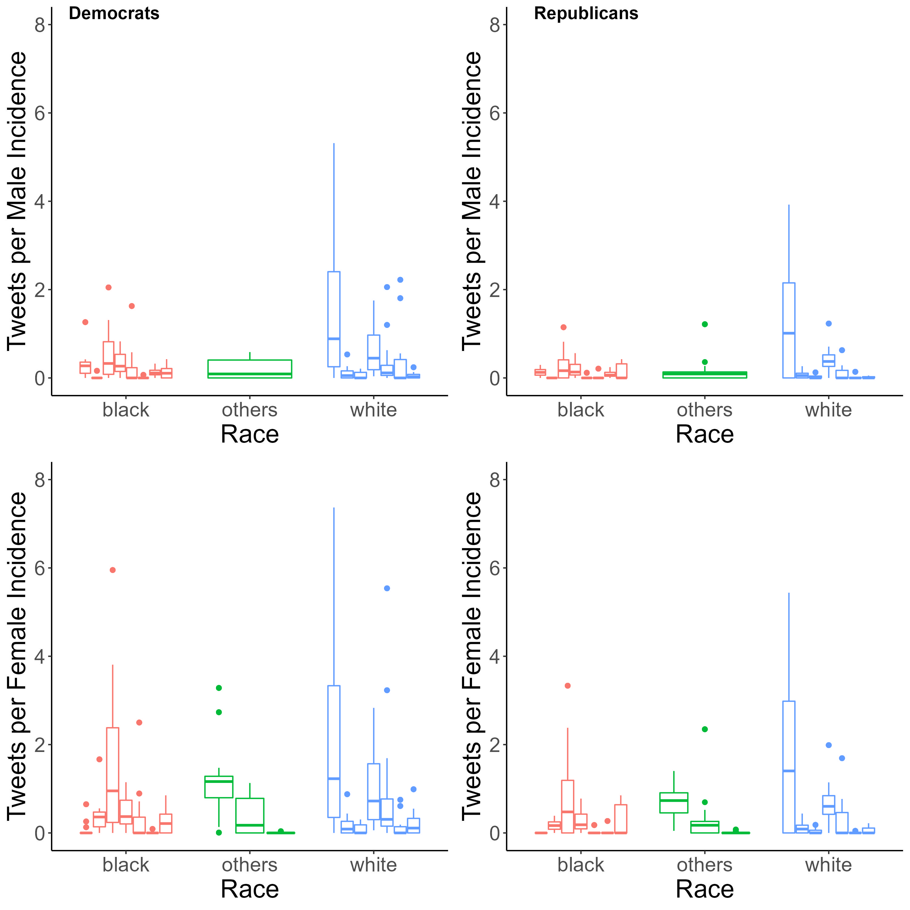
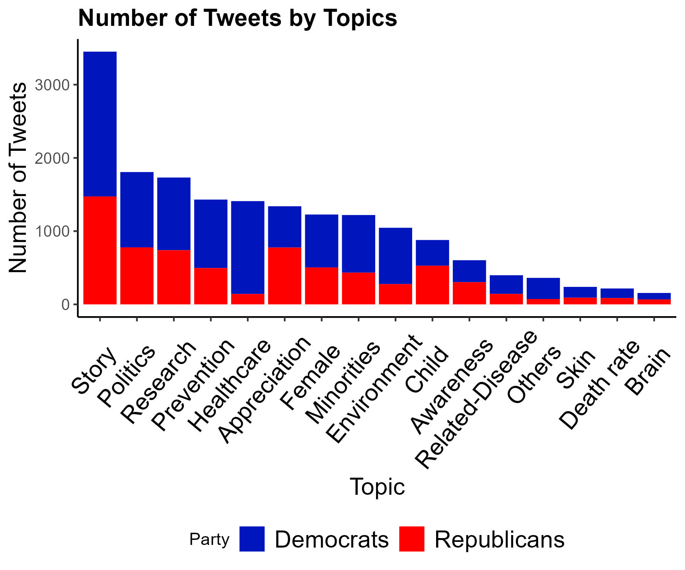
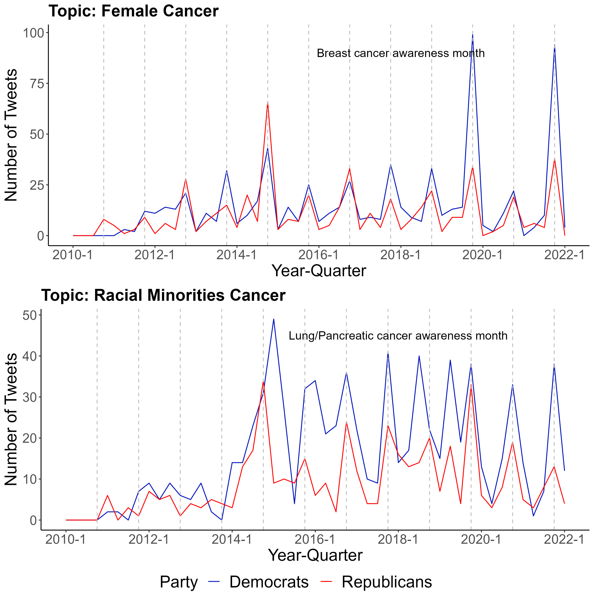
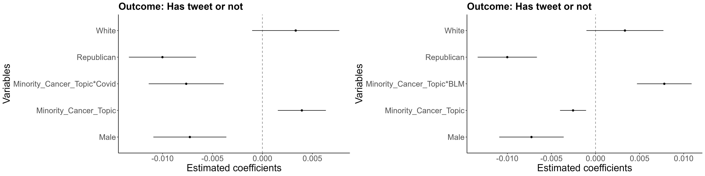

---

##### Download

+ [Poster](poster1.pdf)
<!-- + [Online appendix](appendix2.pdf)
+ [Code and data](https://github.com/pmichaillat/wunk) -->

---

##### Thesis Summary

Policymakers increasingly use social media platforms such as Twitter to release public statements to communicate representations and policy agendas We investigated to what extent partisanship influences attention to cancer related topics on Twitter among congress members in the United States ( and whether the attention is modifiable. We found that Democrats published more cancer related tweets than Republicans Congress members tweeted more about cancers with higher incidence rates among Whites A cancer type with higher incidence rates among Blacks was associated with significantly fewer tweets about that cancer Democrats tweeted more about topics concerning cancer disparities (e g healthcare, environment, and minorities) Tweeting RMC topics was positively associated with tweets published after BLM, but inversely associated with tweets published during the COVID 19 pandemic, suggesting the differential attention is modifiable by external societal events Understanding how to modify policymakers’ attention to cancer may be helpful in addressing cancer disparities in the US.

---


##### Figure 1. Trend of policymakers’ tweets by party.



##### Figure 2. Boxplots of number of tweets by cancer type.



##### Figure 3: Number of tweets by topic by party.



##### Figure 4: The validation of topic classification.



##### Figure 5: Associations between societal events (i.e., Black Lives Matter Movement and COVID-19) and the number of tweets on “racial minorities cancer”cancer”(RMC) topic.



---

<!--

##### Citation

Cheung, JTH., Tang, KC., & Koh, K. (2021). Geographic Clustering of Fast-Food Restaurants Around Secondary Schools in Hong Kong. Preventing Chronic Disease, 18, E56. PMID:34081576. [IF: 4.4]

```BibTeX
@article{PI04,
author = {Cheung, JTH., Tang, KC., & Koh, K. },
year = {2021},
title ={Geographic Clustering of Fast-Food Restaurants Around Secondary Schools in Hong Kong.},
journal = {Preventing Chronic Disease},
volume = {18},
# number = {2},
pages = {E56},
url = {https://www.cdc.gov/pcd/issues/2021/20_0601.htm}}
```

---

##### Related material

+ [Presentation slides](presentation2.pdf)
+ [Wikipedia entry](https://en.wikipedia.org/wiki/The_Finer_Points_of_Sausage_Dogs)

-->
