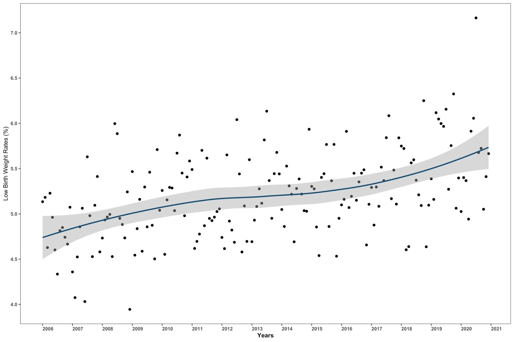
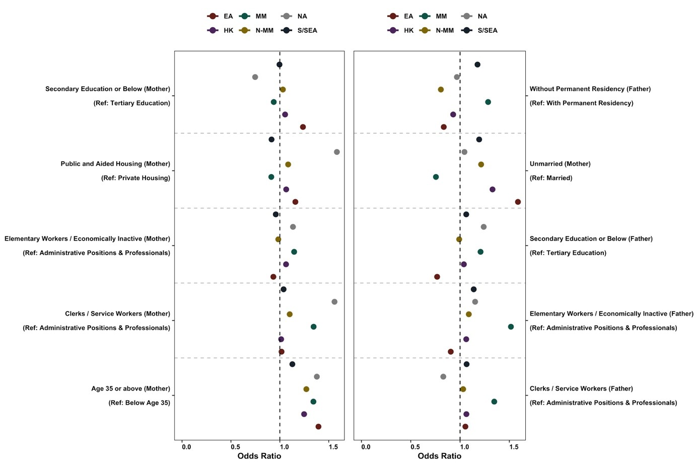
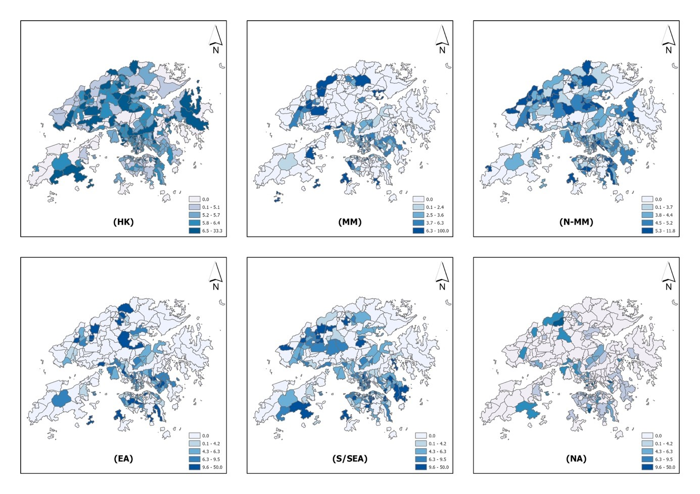
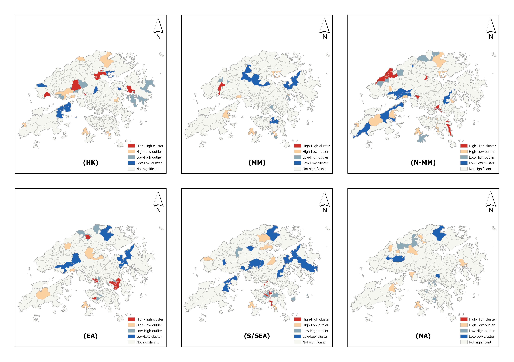

---

##### Download

+ [M.Phil. Thesis](thesis.pdf)
<!-- + [Online appendix](appendix2.pdf)
+ [Code and data](https://github.com/pmichaillat/wunk) -->

---

##### Thesis Summary

Low birthweight (LBW), defined as newborns with a birthweight below 2,500g, is associated with high infant mortality and various morbidities. Certain immigrant groups were found to have higher risks of LBW (i.e., “immigrant disadvantage”), while others may have fewer LBW events (i.e., “healthy immigrant paradox”). This population-based study examines which notion applies to Hong Kong. Using 2006-2020 singleton live birth data in Hong Kong, I examined the prevalence, socioeconomic determinants, and spatial patterns of LBW among natives and immigrant subgroups in Hong Kong. Results showed an increasing trend of LBW events from approximately 4.75% in 2006 to approximately 5.75% in 2020. Compared with the average LBW prevalence among Hong Kong natives (5.76%), South/Southeast Asians had the highest LBW prevalence (6.19%). Substantively lower LBW events were observed among the mothers from Mainland China who conducted maternity migration (i.e., traveling to Hong Kong solely to give birth) (3.23%) and mothers from non-Asian high-income territories (3.26%). The socioeconomic determinants of LBW among natives and immigrant subgroups are heterogeneous, with LBW risks of natives being the most vulnerable to socioeconomic disadvantages. Interestingly, South/Southeast Asian mothers were mostly not prone to the effect of socioeconomic disadvantages on LBW risks. The spatial patterns of LBW across the study groups are heterogeneous, with LBW more clustered only among mothers from Mainland China, East Asian high-income territories and South/Southeast Asian territories. Local clusters are observed in distinct areas across the study groups. The findings suggest that instead of building a universal approach to explain LBW events, moving beyond the dichotomy of “immigrant disadvantage” and “immigrant health paradox” and consideration of the compositions of immigrants in evaluating the epidemiology of LBW are necessary and warranted. Location-specific health intervention should be targeted to the vulnerable population subgroups to mitigate the increasing trend of LBW events in Hong Kong.

---


##### Figure 1: Trend of low birthweight rates in Hong Kong from 2006 to 2020.



##### Figure 2: Coefficient plots of the associations between socioeconomic determinants and LBW of the study population by origin with adjusted estimates of odds ratios.



##### Figure 3: TPU-level spatial distribution of the average LBW rate of the study population by origin, 2006-2020.



##### Figure 4: TPU-level LISA analysis for the average LBW rate of the study population by origin, 2006-2020.



---

<!--

##### Citation

Cheung, JTH., Tang, KC., & Koh, K. (2021). Geographic Clustering of Fast-Food Restaurants Around Secondary Schools in Hong Kong. Preventing Chronic Disease, 18, E56. PMID:34081576. [IF: 4.4]

```BibTeX
@article{PI04,
author = {Cheung, JTH., Tang, KC., & Koh, K. },
year = {2021},
title ={Geographic Clustering of Fast-Food Restaurants Around Secondary Schools in Hong Kong.},
journal = {Preventing Chronic Disease},
volume = {18},
# number = {2},
pages = {E56},
url = {https://www.cdc.gov/pcd/issues/2021/20_0601.htm}}
```

---

##### Related material

+ [Presentation slides](presentation2.pdf)
+ [Wikipedia entry](https://en.wikipedia.org/wiki/The_Finer_Points_of_Sausage_Dogs)

-->
